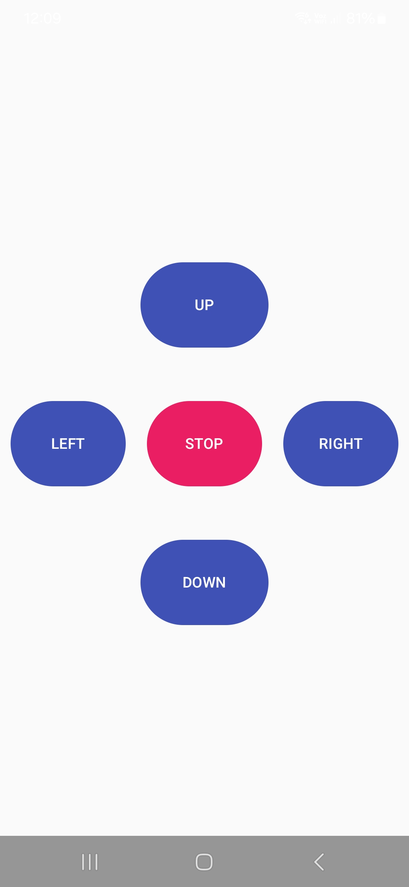
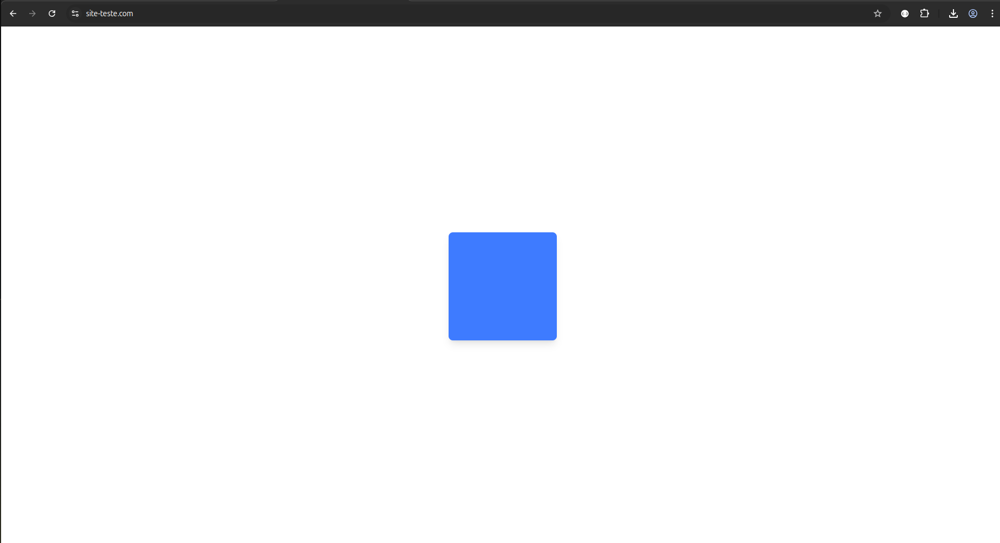

# 📱 Aplicativo Android de Controle Remoto

Aplicativo desenvolvido em Kotlin para controle remoto do quadrado na aplicação web via protocolo UDP.

## 🎨 Telas do Sistema

| Controle Mobile                                                | Visualização Web                                                |
| -------------------------------------------------------------- | --------------------------------------------------------------- |
|  |  |

## 🛠 Stack Tecnológico

### Linguagem e Frameworks

- **Kotlin** - Linguagem principal
- **Jetpack Compose** - UI declarativa
- **Ktor Network** - Comunicação UDP
- **Material Design 3** - Design system

### Dependências Principais

```kotlin
dependencies {
    implementation("io.ktor:ktor-network:2.3.5")
    implementation("androidx.compose.material3:material3:1.1.2")
    // ... outras dependências
}
```
